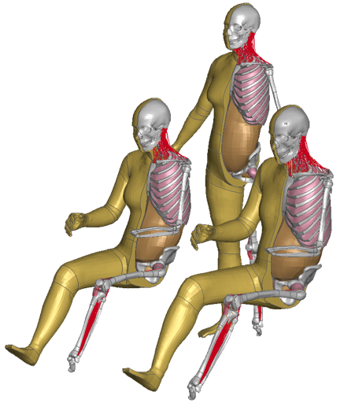

# **VIVA+ Models**

The VIVA+ model line-up consists of average female and male models of vehicle occupants and standing road users

The baseline model is the average female (50F). All the other models are are derivatives of this model. The derivatives are defined with separate meshes and model parameters.

 

## Model parameters

The model parameters are defined in the main key files (`vivaplus-50F.key`/`vivaplus-50M.key` for the occupant models and  `vivaplus-50F-standing.key` for standing model). 

### Sex differences

The sex differences are implemented using `SEX` parameter, with `SEX = 0` for female and `SEX = 1` for male. 

Properties currently controlled by `SEX` parameters:

- Head Mass and inertia properties
- Soft tissues densities
- Knee ligaments
- Quadriceps muscle

<!--
### Age differences

## Background

Intial VIVA models [ViVA Open Human Body Model](https://www.chalmers.se/en/projects/pages/openhbm.aspx).[@Oesth2017b]

## Why average female?

[@Brolin2015]

## Open models

## Road Traffic Safety

### An overview of Global Health Burden from Road traffic incidents

<iframe src="https://ourworldindata.org/grapher/road-death-rate-vs-gdp-per-capita" style="width: 100%; height: 600px; border: 0px none;"></iframe>

<iframe src="https://ourworldindata.org/grapher/road-incident-deaths-by-age" style="width: 100%; height: 600px; border: 0px none;"></iframe> 

\bibliography-->